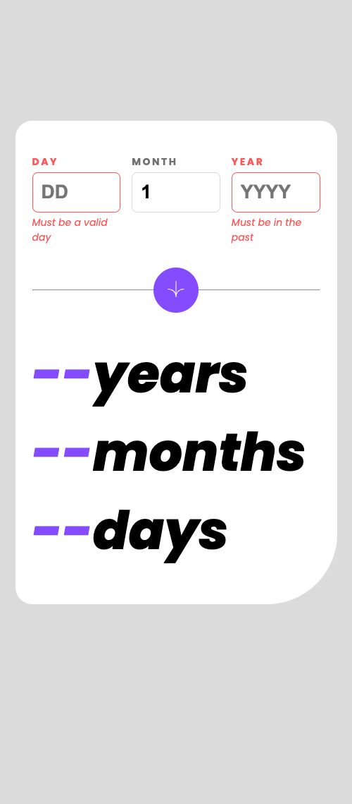

# Frontend Mentor - Age calculator app solution

This is a solution to the [Age calculator app challenge on Frontend Mentor](https://www.frontendmentor.io/challenges/age-calculator-app-dF9DFFpj-Q). Frontend Mentor challenges help you improve your coding skills by building realistic projects.

## Table of contents

- [Overview](#overview)
  - [The challenge](#the-challenge)
  - [Screenshot](#screenshot)
  - [Links](#links)
- [My process](#my-process)
  - [Built with](#built-with)
  - [What I learned](#what-i-learned)
  - [Continued development](#continued-development)
  - [Useful resources](#useful-resources)
- [Author](#author)

## Overview

### The challenge

Users should be able to:

- View an age in years, months, and days after submitting a valid date through the form
- Receive validation errors if:
  - Any field is empty when the form is submitted
  - The day number is not between 1-31
  - The month number is not between 1-12
  - The year is in the future
  - The date is invalid e.g. 31/04/1991 (there are 30 days in April)
- View the optimal layout for the interface depending on their device's screen size
- See hover and focus states for all interactive elements on the page

### Screenshot




### Links

- Solution URL: [Github](https://github.com/delroscol98/age-calculator)
- Live Site URL: [Netlify](https://main--chic-tulumba-98c9e7.netlify.app/)

## My process

### Built with

- Semantic HTML5 markup
- CSS custom properties
- Flexbox
- CSS Grid
- Mobile-first workflow
- [React](https://reactjs.org/) - JS library

### What I learned

This was my first time using React on my own without a tutorial solution. It was difficult handling the form validations and tried two different approaches. Once I found using multiple useState hooks to be very messy and inefficient, I switched to 3 state objects: one for input data, one for validations, one for rendering the age and found this be very clean. Below is my submitHandler function which is triggered at each button click:

```js
const submitHandler = (e) => {
  e.preventDefault();
  const validationErrors = {};
  const ageOutput = {};
  if (!formData.day.trim() || +formData.day < 1 || +formData.day > 31) {
    validationErrors.day = "Must be a valid day";
  } else {
    ageOutput.day = Math.abs(new Date().getDate() - +formData.day);
  }

  if (!formData.month.trim() || formData.month < 1 || formData.month > 12) {
    validationErrors.month = "Must be a valid month";
  } else {
    ageOutput.month = Math.abs(new Date().getMonth() - +formData.month + 1);
  }

  if (!formData.year.trim() || formData.year > new Date().getFullYear()) {
    validationErrors.year = "Must be in the past";
  } else {
    ageOutput.year = new Date().getFullYear() - +formData.year;
  }

  if (Object.keys(validationErrors).length !== 0) {
    setErrors(validationErrors);
    setAge({
      day: "--",
      month: "--",
      year: "--",
    });
  } else {
    setErrors({});
    setAge(ageOutput);
  }
};
```

### Continued development

Focus for future:

- Using objects for form validation rather than individual inputs
- Continue using Semantic HTML tags in my JSX
- Understanding state changes over time

### Useful resources

- [Code With Yousaf - Youtube](https://www.youtube.com/watch?v=yra7iNwAjL4) - This video helped me to validate the form inputs.

## Author

- Frontend Mentor - [@delroscol98](https://www.frontendmentor.io/profile/delroscol98)
